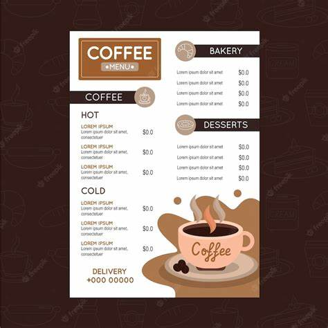

# Cozy-Cup-Cafe

## Project Description
Cozy Cup Cafe is a delightful virtual coffee shop where users can explore various coffee blends, pastries, and snacks. They can conveniently place orders for pickup or delivery and even make reservations to secure a cozy spot in the cafe.

## Features
- Easy menu exploration for coffee, pastries, and snacks
- Seamless order placement for pickup or delivery
- Table reservations for a cozy cafe experience
- Secure account management system
- Order tracking to monitor the status of placed orders
- Integration with payment gateways for smooth transactions

## Screen Captures

  
    The image captures the warm and inviting ambiance of Cozy Cup Cafe, with soft lighting, comfortable seating, and a relaxed atmosphere. Whether you're meeting friends for a leisurely chat, settling in with a good book, or simply enjoying a quiet moment alone, our cafe provides the perfect setting to unwind and savor your favorite beverages and treats. Join us at Cozy Cup Cafe, where every visit feels like a comforting retreat from the hustle and bustle of daily life.

     The menu page showcases a mouthwatering array of delectable treats, including aromatic coffee blends, freshly baked pastries, and irresistible snacks. From rich espresso drinks to delicate pastries and savory bites, our menu offers something to delight every palate. Explore our diverse selection and indulge in the perfect pairing to accompany your cozy cafe experience at Cozy Cup Cafe.

     The reservation interface offers patrons the opportunity to secure their preferred spot in the cozy ambiance of Cozy Cup Cafe. With intuitive date and time selection options, customers can plan ahead for gatherings with friends, romantic dates, or solo moments of relaxation. Whether it's for a special occasion or simply to guarantee a tranquil space, our table reservation system ensures that every visitor can enjoy a personalized and comfortable experience at our cafe. Reserve your table today and look forward to a delightful time at Cozy Cup Cafe.

    The order placement feature at Cozy Cup Cafe streamlines the process of securing your favorite beverages and treats for pickup or delivery. With a user-friendly interface, customers can effortlessly browse through our menu, select their desired items, and customize their orders to suit their preferences. Whether you're craving a steaming cup of coffee to kickstart your day or a tempting pastry for an afternoon treat, placing your order is simple and convenient. Enjoy the ease and efficiency of ordering from Cozy Cup Cafe, where satisfying your cravings is just a few clicks away.

## About the Authors

**Name:** Ailene Grace T. Heredero  
**Email:**ailenegraceheredero@gmail.com

